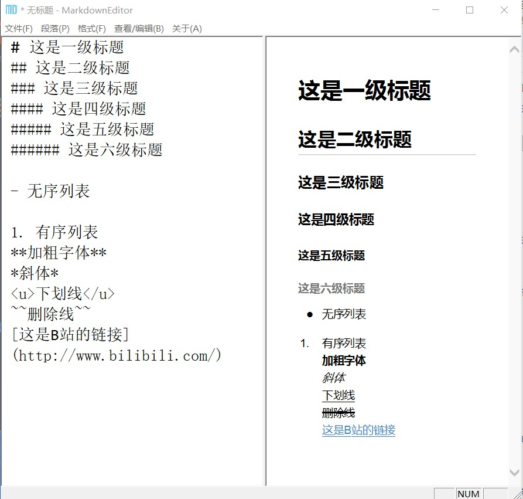

MarkdownEditor
==============

本软件从jijinggang仓库拷贝而来，采用c++ , 单文件，没有其他的附带

截图如下

下载
--------

https://github.com/AAAleaf/MarkdownEditor/tree/master/download

Usage
-----
MarkdownEditor DON'T need any config by default. You can replace default css style, please copy your markdown css file into the directory of MarkdownEditor, then rename to `user.css` 

License
--------
MarkdownEditor is licensed under the MIT License.
A copy of the MIT License is included in this file.

其他的懒得写了，增加了一些段落和格式以及快捷键，都是让AI写的，我自己打包测试，后续再看看能不能增加其他功能
